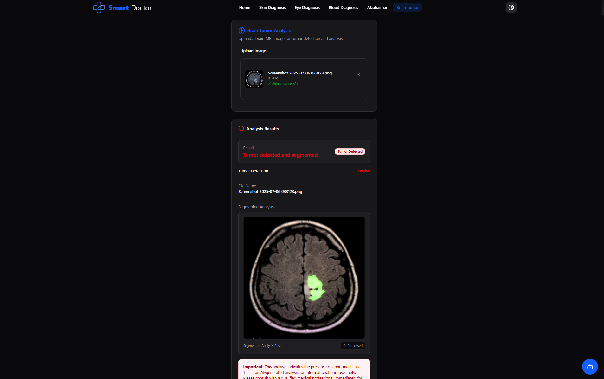

<div align="center">

# 🩺 Smart Doctor

### AI-Powered Medical Diagnostics Platform

[](https://python.org)
[](https://fastapi.tiangolo.com)
[](https://nextjs.org)
[](https://docker.com)
[](https://huggingface.co)
[](https://tensorflow.org)

**An enterprise-grade AI diagnostic system integrating five specialized deep learning models for automated disease detection from medical images, powered by an intelligent medical chatbot.**

[🌐 Live Platform](https://smart-doctorr.vercel.app/) · [📖 Documentation](#-system-architecture) · [🚀 Quick Start](#-installation-guide)

---

<!-- Add your demo screenshot here: ./assets/demo.png -->


</div>

---

## 📋 Table of Contents

- [Project Overview](#-project-overview)
- [System Architecture](#-system-architecture)
- [AI Models Breakdown](#-ai-models-breakdown)
- [Brain Tumor Two-Stage Pipeline](#-brain-tumor-two-stage-pipeline)
- [Chatbot Capabilities](#-chatbot-capabilities)
- [Tech Stack](#-tech-stack)
- [Deployment Architecture](#-deployment-architecture)
- [Platform Features](#-platform-features)
- [Real-Time Inference Workflow](#-real-time-inference-workflow)
- [Installation Guide](#-installation-guide)
- [API Structure](#-api-structure)
- [Demo](#-demo)
- [Future Improvements](#-future-improvements)
- [Contributors](#-contributors)
- [License](#-license)

---

## 🎯 Project Overview

**Smart Doctor** is a comprehensive AI-powered medical diagnostics platform designed to assist healthcare professionals and patients with automated disease detection and medical guidance. The platform leverages state-of-the-art deep learning models to analyze medical images across multiple diagnostic domains.

### Key Highlights

| Feature | Description |
|---------|-------------|
| 🧠 **5 AI Models** | Specialized deep learning models for different medical conditions |
| 🔬 **Multi-Stage Analysis** | Advanced two-stage pipeline for brain tumor detection |
| 💬 **AI Medical Chatbot** | Intelligent assistant for medical inquiries and result interpretation |
| ⚡ **Real-Time Inference** | Sub-second diagnostic predictions via optimized API endpoints |
| 🐳 **Containerized Deployment** | Production-ready Docker & Docker Compose configuration |
| 🌐 **Cloud-Native** | Deployed on Hugging Face Spaces with global CDN distribution |

---

## 🏗 System Architecture

```
┌─────────────────────────────────────────────────────────────────────────────┐
│                           SMART DOCTOR PLATFORM                              │
├─────────────────────────────────────────────────────────────────────────────┤
│                                                                              │
│  ┌──────────────┐    ┌──────────────────────────────────────────────────┐   │
│  │   Frontend   │    │              AI Inference Engine                  │   │
│  │   (Next.js)  │◄──►│  ┌─────────────────────────────────────────────┐ │   │
│  │              │    │  │           Hugging Face Spaces                │ │   │
│  │  • Dashboard │    │  │  ┌─────────┐ ┌─────────┐ ┌─────────┐        │ │   │
│  │  • Upload UI │    │  │  │ Brain   │ │  Eye    │ │  Skin   │        │ │   │
│  │  • Results   │    │  │  │ Tumor   │ │ Disease │ │ Disease │        │ │   │
│  │  • Chatbot   │    │  │  └────┬────┘ └────┬────┘ └────┬────┘        │ │   │
│  └──────┬───────┘    │  │       │           │           │              │ │   │
│         │            │  │  ┌────▼────┐ ┌────▼────┐ ┌────▼────┐        │ │   │
│         │            │  │  │Alzheimer│ │ Blood   │ │ Medical │        │ │   │
│         │            │  │  │Detection│ │ Analysis│ │ Chatbot │        │ │   │
│         │            │  │  └─────────┘ └─────────┘ └─────────┘        │ │   │
│         │            │  └─────────────────────────────────────────────┘ │   │
│         │            └──────────────────────────────────────────────────┘   │
│         │                                                                    │
│         │            ┌──────────────────────────────────────────────────┐   │
│         └───────────►│              FastAPI Backend                      │   │
│                      │  • RESTful API Endpoints                          │   │
│                      │  • Image Preprocessing Pipeline                   │   │
│                      │  • Model Orchestration Layer                      │   │
│                      │  • Response Formatting & Validation               │   │
│                      └──────────────────────────────────────────────────┘   │
│                                                                              │
└─────────────────────────────────────────────────────────────────────────────┘
```

---

## 🤖 AI Models Breakdown

Smart Doctor integrates **five specialized deep learning models**, each optimized for specific medical diagnostic tasks:

### Model Portfolio

| Model | Task | Architecture | Input | Output |
|-------|------|--------------|-------|--------|
| 🧠 **Brain Tumor Classifier** | Tumor Presence Detection | Custom CNN | MRI Scans | Binary Classification |
| 🧠 **Brain Tumor Segmentor** | Tumor Localization | ResUNet | MRI Scans | Segmentation Mask |
| 👁️ **Eye Disease Detector** | Retinal Disease Classification | Deep CNN | Fundus Images | Multi-class Classification |
| 🔬 **Skin Lesion Analyzer** | Dermatological Diagnosis | Transfer Learning | Skin Images | Disease Classification |
| 🩸 **Blood Cell Analyzer** | Hematological Analysis | CNN Classifier | Blood Smear Images | Cell Classification |
| 🧓 **Alzheimer's Detector** | Cognitive Decline Detection | Deep Neural Network | Brain Scans | Stage Classification |

### Model Deployment Links

| Model | Hugging Face Space |
|-------|-------------------|
| Brain Tumor Detection | [🔗 Brain_Tumor1](https://huggingface.co/spaces/Mostafa3x/Brain_Tumor1) |
| Image Prediction | [🔗 ahmed_predict_image](https://huggingface.co/spaces/Mostafa3x/ahmed_predict_image) |
| Eye Disease Detection | [🔗 eye_model](https://huggingface.co/spaces/Mostafa3x/eye_model) |

---

## 🧠 Brain Tumor Two-Stage Pipeline

The Brain Tumor Detection System employs a sophisticated **two-stage deep learning pipeline** for accurate tumor identification and precise localization.

```
┌─────────────────────────────────────────────────────────────────────────────┐
│                    BRAIN TUMOR DETECTION PIPELINE                            │
├─────────────────────────────────────────────────────────────────────────────┤
│                                                                              │
│   INPUT                    STAGE 1                      STAGE 2              │
│  ┌──────┐              ┌───────────────┐            ┌───────────────┐        │
│  │ MRI  │              │ CLASSIFICATION│            │ SEGMENTATION  │        │
│  │Scan  │─────────────►│    MODEL     │───────────►│    MODEL      │        │
│  │      │              │              │            │  (ResUNet)    │        │
│  └──────┘              │ Tumor? Y/N   │            │               │        │
│                        └───────┬───────┘            └───────┬───────┘        │
│                                │                            │                │
│                                ▼                            ▼                │
│                        ┌───────────────┐            ┌───────────────┐        │
│                        │   POSITIVE    │            │ TUMOR MASK    │        │
│                        │ Tumor Detected│            │ Localization  │        │
│                        │ Confidence: X%│            │ Visualization │        │
│                        └───────────────┘            └───────────────┘        │
│                                                                              │
└─────────────────────────────────────────────────────────────────────────────┘
```

### Stage 1: Classification Model (Tumor Presence Detection)

- **Purpose**: Binary classification to determine tumor presence
- **Architecture**: Custom Convolutional Neural Network
- **Output**: `{ has_tumor: boolean, confidence: float }`
- **Notebook**: [Brain_Tumor_Classification.ipynb](https://github.com/MostafaAyman3/BrainTumor/blob/main/Brain_Tumor_Classification.ipynb)

### Stage 2: Segmentation Model (Tumor Localization)

- **Purpose**: Pixel-level tumor localization and boundary delineation
- **Architecture**: ResUNet (Residual U-Net)
- **Output**: Segmentation mask overlay on original MRI
- **Notebook**: [Brain_MRI_Detection_Segmentation_ResUNet.ipynb](https://github.com/MostafaAyman3/BrainTumor/blob/main/Brain_MRI_Detection_%7C_Segmentation_%7C_ResUNet_final.ipynb)

### Pipeline Flow

1. **Image Upload** → User uploads brain MRI scan
2. **Preprocessing** → Image normalization and resizing
3. **Classification** → Stage 1 model determines tumor presence
4. **Conditional Segmentation** → If tumor detected, Stage 2 generates localization mask
5. **Result Compilation** → Combined results with visual overlay returned to user

---

## 💬 Chatbot Capabilities

The **AI Medical Chatbot** serves as an intelligent medical assistant, powered by advanced language models to provide:

### Core Features

| Capability | Description |
|------------|-------------|
| 🏥 **Medical Q&A** | Answers general medical questions with evidence-based information |
| 📊 **Result Interpretation** | Helps users understand AI diagnostic predictions |
| 💊 **Symptom Guidance** | Provides preliminary symptom analysis and recommendations |
| 📚 **Health Education** | Delivers educational content about various medical conditions |
| 🔄 **Contextual Awareness** | Maintains conversation context for coherent multi-turn dialogues |

### Integration

```typescript
// Chatbot powered by Google GenAI
import { GoogleGenerativeAI } from "@google/genai";
```

> ⚠️ **Disclaimer**: The chatbot provides informational assistance only and does not replace professional medical advice.

---

## 🛠 Tech Stack

<div align="center">

### Frontend


### Backend & AI


### Infrastructure


</div>

### Complete Technology Matrix

| Layer | Technologies |
|-------|-------------|
| **Frontend Framework** | Next.js 15, React 19, TypeScript |
| **UI Components** | Radix UI, Tailwind CSS, Lucide Icons |
| **State Management** | React Hooks, Context API |
| **Form Handling** | React Hook Form, Zod Validation |
| **Backend API** | FastAPI, Uvicorn, Pydantic |
| **Deep Learning** | TensorFlow, Keras, PyTorch |
| **Image Processing** | OpenCV, Pillow, NumPy |
| **Model Serving** | Hugging Face Spaces, Gradio |
| **Containerization** | Docker, Docker Compose |
| **Deployment** | Vercel (Frontend), HuggingFace (Models) |

---

## 🚀 Deployment Architecture

```
┌─────────────────────────────────────────────────────────────────────────────┐
│                        DEPLOYMENT ARCHITECTURE                               │
├─────────────────────────────────────────────────────────────────────────────┤
│                                                                              │
│  ┌─────────────────┐         ┌─────────────────┐         ┌───────────────┐  │
│  │     VERCEL      │         │   HUGGING FACE  │         │    DOCKER     │  │
│  │  (Frontend CDN) │◄───────►│     SPACES      │◄───────►│   COMPOSE     │  │
│  │                 │   API   │  (Model Hosting)│         │ (Local Dev)   │  │
│  │  • Next.js App  │  Calls  │                 │         │               │  │
│  │  • Static Assets│         │  • Brain Tumor  │         │  • FastAPI    │  │
│  │  • Edge Network │         │  • Eye Disease  │         │  • Models     │  │
│  │                 │         │  • Prediction   │         │  • Services   │  │
│  └─────────────────┘         └─────────────────┘         └───────────────┘  │
│          │                            │                          │          │
│          │                            │                          │          │
│          ▼                            ▼                          ▼          │
│  ┌─────────────────────────────────────────────────────────────────────────┐│
│  │                         GLOBAL EDGE NETWORK                              ││
│  │        Low-latency inference delivery to users worldwide                 ││
│  └─────────────────────────────────────────────────────────────────────────┘│
│                                                                              │
└─────────────────────────────────────────────────────────────────────────────┘
```

### Deployment Components

| Component | Platform | Purpose |
|-----------|----------|---------|
| **Web Application** | Vercel | Next.js frontend with global CDN |
| **AI Models** | Hugging Face Spaces | Scalable model inference endpoints |
| **API Backend** | Docker + FastAPI | RESTful API orchestration |
| **Model Storage** | Hugging Face Hub | Version-controlled model artifacts |

---

## ✨ Platform Features

### 🖼️ Multi-Modal Medical Image Analysis

- **Brain MRI Scans** → Tumor detection and segmentation
- **Fundus Photography** → Retinal disease classification
- **Skin Lesion Images** → Dermatological diagnosis
- **Blood Smear Images** → Hematological cell analysis
- **Brain Scans** → Alzheimer's disease staging

### 🎨 User Experience

- **Intuitive Upload Interface** → Drag-and-drop medical image upload
- **Real-Time Progress Indicators** → Visual feedback during analysis
- **Detailed Result Visualization** → Confidence scores and segmentation overlays
- **Responsive Design** → Optimized for desktop and mobile devices
- **Dark/Light Mode** → Accessible theme switching

### 🔒 Security & Privacy

- **No Data Persistence** → Images processed in-memory only
- **Encrypted Transmission** → HTTPS for all API communications
- **CORS Configuration** → Secure cross-origin requests

---

## ⚡ Real-Time Inference Workflow

```
┌──────────────────────────────────────────────────────────────────────────────┐
│                      REAL-TIME INFERENCE WORKFLOW                             │
├──────────────────────────────────────────────────────────────────────────────┤
│                                                                               │
│   USER                FRONTEND              BACKEND              AI MODEL     │
│    │                     │                     │                     │        │
│    │  1. Upload Image    │                     │                     │        │
│    │────────────────────►│                     │                     │        │
│    │                     │                     │                     │        │
│    │                     │  2. FormData POST   │                     │        │
│    │                     │────────────────────►│                     │        │
│    │                     │                     │                     │        │
│    │                     │                     │  3. Preprocess &    │        │
│    │                     │                     │     Forward Pass    │        │
│    │                     │                     │────────────────────►│        │
│    │                     │                     │                     │        │
│    │                     │                     │  4. Predictions     │        │
│    │                     │                     │◄────────────────────│        │
│    │                     │                     │                     │        │
│    │                     │  5. JSON Response   │                     │        │
│    │                     │◄────────────────────│                     │        │
│    │                     │                     │                     │        │
│    │  6. Display Results │                     │                     │        │
│    │◄────────────────────│                     │                     │        │
│    │                     │                     │                     │        │
│   ─┴─                   ─┴─                   ─┴─                   ─┴─       │
│                                                                               │
│   Average Latency: < 2 seconds for classification                            │
│   Average Latency: < 5 seconds for segmentation                              │
│                                                                               │
└──────────────────────────────────────────────────────────────────────────────┘
```

### Workflow Steps

1. **Image Upload**: User selects medical image via drag-and-drop interface
2. **API Request**: Frontend sends FormData to FastAPI endpoint
3. **Preprocessing**: Image resized, normalized, and formatted for model input
4. **Inference**: Deep learning model processes image and generates predictions
5. **Response**: Structured JSON with predictions, confidence scores, and visualizations
6. **Display**: Results rendered with interactive UI components

---

## 📦 Installation Guide

### Prerequisites

- Docker & Docker Compose installed
- Node.js 18+ (for local frontend development)
- Git

### Quick Start with Docker Compose

```bash
# Clone the repository
git clone https://github.com/MostafaAyman3/Final-project.git
cd Final-project

# Start all services
docker-compose up -d

# Access the application
# Frontend: http://localhost:3000
# API Docs: http://localhost:8000/docs
```

### Local Development Setup

```bash
# Clone the repository
git clone https://github.com/MostafaAyman3/Final-project.git
cd Final-project

# Install dependencies
npm install
# or
bun install

# Start development server
npm run dev
# or
bun dev

# Open http://localhost:3000
```

### Environment Variables

Create a `.env.local` file in the root directory:

```env
# API Configuration
NEXT_PUBLIC_API_URL=https://your-api-endpoint.com

# Google GenAI (for Chatbot)
GOOGLE_GENAI_API_KEY=your_api_key_here
```

### Docker Compose Configuration

```yaml
version: '3.8'

services:
  frontend:
    build:
      context: .
      dockerfile: Dockerfile
    ports:
      - "3000:3000"
    environment:
      - NODE_ENV=production
    depends_on:
      - api

  api:
    build:
      context: ./api
      dockerfile: Dockerfile
    ports:
      - "8000:8000"
    volumes:
      - ./models:/app/models
    environment:
      - MODEL_PATH=/app/models
```

---

## 🔌 API Structure

### Base Endpoints

| Method | Endpoint | Description |
|--------|----------|-------------|
| `POST` | `/predict-tumor/` | Brain tumor detection & segmentation |
| `POST` | `/eye-predict/` | Eye disease classification |
| `POST` | `/skin-predict/` | Skin lesion analysis |
| `POST` | `/blood-predict/` | Blood cell classification |
| `POST` | `/alzheimer-predict/` | Alzheimer's detection |
| `POST` | `/chat/` | Medical chatbot interaction |

### Request Format

```bash
# Example: Brain Tumor Detection
curl -X POST "https://mostafa3x-brain-tumor1.hf.space/predict-tumor/" \
  -H "Content-Type: multipart/form-data" \
  -F "file=@brain_scan.jpg"
```

### Response Schema

```json
{
  "result": "Tumor detected in the frontal lobe region",
  "has_tumor": true,
  "segmented_image": "base64_encoded_image_string",
  "filename": "brain_scan.jpg",
  "confidence": 0.94
}
```

### API Documentation

Interactive API documentation available at:
- **Swagger UI**: `/docs`
- **ReDoc**: `/redoc`

---

## 🎬 Demo

<div align="center">

### Platform Preview

<!-- Add your demo screenshot here -->


### Brain Tumor Model Demo



### Live Demo

🌐 **[Try Smart Doctor Now →](https://smart-doctorr.vercel.app/)**

</div>

### Feature Demonstrations

| Feature | Description |
|---------|-------------|
| 🧠 **Brain Tumor Analysis** | Upload MRI scan → Get tumor detection + segmentation mask |
| 👁️ **Eye Disease Detection** | Upload fundus image → Get disease classification |
| 💬 **AI Chatbot** | Ask medical questions → Get intelligent responses |

---

## 🔮 Future Improvements

### Planned Features

| Priority | Feature | Description |
|----------|---------|-------------|
| 🔴 High | **Multi-Language Support** | Arabic, Spanish, French medical chatbot |
| 🔴 High | **Mobile Application** | React Native cross-platform app |
| 🟡 Medium | **Report Generation** | PDF diagnostic reports with visualizations |
| 🟡 Medium | **Doctor Dashboard** | Professional interface for healthcare providers |
| 🟢 Low | **Model Versioning** | A/B testing for model improvements |
| 🟢 Low | **Federated Learning** | Privacy-preserving model training |

### Research Roadmap

- [ ] Integration of attention mechanism visualization
- [ ] Multi-modal fusion (combining image + text data)
- [ ] Explainable AI (XAI) for diagnostic transparency
- [ ] DICOM file format support
- [ ] HL7 FHIR healthcare data interoperability

---

## 👥 Contributors

<div align="center">

### Core Team

| Contributor | Role | GitHub |
|-------------|------|--------|
| **Mostafa Ayman** | Lead Developer & ML Engineer | [@MostafaAyman3](https://github.com/MostafaAyman3) |

### Contributing

We welcome contributions! Please follow these steps:

```bash
# Fork the repository
# Create your feature branch
git checkout -b feature/AmazingFeature

# Commit your changes
git commit -m 'Add some AmazingFeature'

# Push to the branch
git push origin feature/AmazingFeature

# Open a Pull Request
```

</div>

---

## 📄 License

<div align="center">

This project is licensed under the **MIT License** - see the [LICENSE](LICENSE) file for details.

```
MIT License

Copyright (c) 2024 Smart Doctor

Permission is hereby granted, free of charge, to any person obtaining a copy
of this software and associated documentation files (the "Software"), to deal
in the Software without restriction, including without limitation the rights
to use, copy, modify, merge, publish, distribute, sublicense, and/or sell
copies of the Software, and to permit persons to whom the Software is
furnished to do so, subject to the following conditions:

The above copyright notice and this permission notice shall be included in all
copies or substantial portions of the Software.
```

</div>

---

<div align="center">

### ⭐ Star this repository if you find it helpful!

**[🌐 Live Platform](https://smart-doctorr.vercel.app/)** · **[🐛 Report Bug](https://github.com/MostafaAyman3/Final-project/issues)** · **[💡 Request Feature](https://github.com/MostafaAyman3/Final-project/issues)**

---

<sub>Built with ❤️ by the Smart Doctor Team | Empowering Healthcare with AI</sub>

</div>
